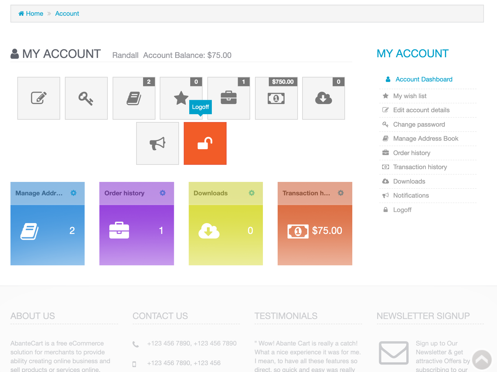

<!--
To README zostało automatycznie wygenerowane przez <https://github.com/YunoHost/apps/tree/master/tools/readme_generator>
Nie powinno być ono edytowane ręcznie.
-->

# Abantecart dla YunoHost

[](https://ci-apps.yunohost.org/ci/apps/abantecart/)


[](https://install-app.yunohost.org/?app=abantecart)

*[Przeczytaj plik README w innym języku.](./ALL_README.md)*

> *Ta aplikacja pozwala na szybką i prostą instalację Abantecart na serwerze YunoHost.*  
> *Jeżeli nie masz YunoHost zapoznaj się z [poradnikiem](https://yunohost.org/install) instalacji.*

## Przegląd

AbanteCart is a ecommerce platform to power online retail. AbanteCart is a ready to run web application as well as reliable foundation to build custom eCommerce solutions. AbanteCart ecommerce platform is designed to fit a wide variety of online businesses and applications, as well as can be configured or customized to perform very specific business requirements.

**Dostarczona wersja:** 1.4.0~ynh1

**Demo:** <https://www.abantecart.com/shopping-cart-demo>

## Zrzuty ekranu



## Dokumentacja i zasoby

- Oficjalna strona aplikacji: <https://www.abantecart.com/>
- Oficjalna dokumentacja: <https://abantecart.atlassian.net/wiki/spaces/AD/overview?homepageId=3506313>
- Oficjalna dokumentacja dla administratora: <https://docs.abantecart.com/>
- Repozytorium z kodem źródłowym: <https://github.com/abantecart/abantecart-src>
- Sklep YunoHost: <https://apps.yunohost.org/app/abantecart>
- Zgłaszanie błędów: <https://github.com/YunoHost-Apps/abantecart_ynh/issues>

## Informacje od twórców

Wyślij swój pull request do [gałęzi `testing`](https://github.com/YunoHost-Apps/abantecart_ynh/tree/testing).

Aby wypróbować gałąź `testing` postępuj zgodnie z instrukcjami:

```bash
sudo yunohost app install https://github.com/YunoHost-Apps/abantecart_ynh/tree/testing --debug
lub
sudo yunohost app upgrade abantecart -u https://github.com/YunoHost-Apps/abantecart_ynh/tree/testing --debug
```

**Więcej informacji o tworzeniu paczek aplikacji:** <https://yunohost.org/packaging_apps>
